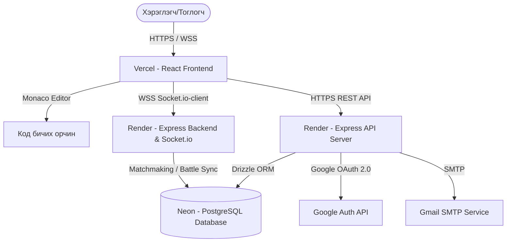

# ТӨГСӨЛТИЙН ТӨСЛИЙН ТАЙЛАН
## Сэдэв: Battle Arena — Бодит хугацааны кодчиллын тулааны талбар вэб платформ

---

# 1. ТАНИЛЦУУЛГА (Үнэлгээ: 15 оноо)

## 1.1 Төслийн зорилго
Энэхүү төслийн зорилго нь програмчлал, алгоритм болон өгөгдлийн бүтцэд суралцагчдад зориулан алгоритмын бодлогуудыг уламжлалт уйтгартай хэлбэрээр бус, харин өрсөлдөөнтэй тоглоомын горим (Gamified) ашиглан бодит хугацаанд (real-time) өрсөлдөгчтэйгөө уралдан бодож, ур чадвараа хурдан, сонирхолтой аргаар хөгжүүлэх боломжийг олгох **Battle Arena** системийг хөгжүүлэхэд оршино.

## 1.2 Төслийн зорилт ба хамрах хүрээ
Төслийн хүрээнд дараах үндсэн зорилтуудыг дэвшүүлж, хэрэгжүүлсэн болно:
1. **Бодит хугацааны PvP (Player vs Player) тулааны систем**: Хэрэглэгчид лобби үүсгэж найзуудаа урих, эсвэл ELO чансааны дагуу автоматаар өрсөлдөгч олж 1v1 горимоор алгоритмын бодлого уралдаж бодох систем.
2. **PvE (Player vs Environment) Хамтын ажиллагааны систем**: Тоглогчид хамтран хүчирхэг боссуудтай (жишээ нь: Shadow Lord) тулалдаж, даалгаврыг хамтран гүйцэтгэх горим.
3. **Үнэлгээ болон Хөгжүүлэлтийн хэсэг**: Бодсон бодлогын түүх, ELO чансааны өөрчлөлт, амжилтын хувийг харуулсан нарийвчилсан статистик бүхий аналитик самбар.
4. **Ажилд авах хэсэг (Hiring Portal)**: Компаниуд чадварлаг кодеруудын гүйцэтгэлийг үнэлж, ажлын санал илгээх интерфейс.

## 1.3 Танилцуулгын бүтэц
Төслийн баримт бичиг нь дараах логик дараалалтайгаар бүтэцлэгдсэн:
* **Асуудал ба шийдэл**: Зах зээл дээрх одоогийн системүүдийн сул талыг тодорхойлж, шийдлийг санал болгоно.
* **Техникийн дэд бүтэц**: Ашигласан технологи, архитектурын зураглал, аюулгүй байдал.
* **Кодын хэрэгжилт**: Кодын чанар, хэрэгжүүлсэн функционалиуд, демо ажиллагаа.
* **Эрсдэлийн менежмент**: Төслийн эрсдэлийг тооцоолж, авах арга хэмжээг төлөвлөх.

---

# 2. АСУУДАЛ БА ШИЙДЭЛ (Үнэлгээ: 25 оноо)

## 2.1 Асуудлыг тодорхойлсон байдал (Нотолгоотой)
Өнөөгийн мэдээллийн технологийн салбарт програм хангамжийн инженерүүдийн алгоритмын сэтгэлгээг шалгах, хөгжүүлэх уламжлалт платформууд дараах асуудлуудтай тулгарч байна:
* **Бага идэвхжүүлэлт (Low Engagement)**: Суралцагчид бодлого бодож байх явцдаа амархан шантрах, уйдах хандлагатай байдаг. (Уламжлалт LeetCode нь хэт академик шинжтэй).
* **Бодит хугацааны интерактив холболт байхгүй**: Бусад кодеруудтай шууд нэг цаг хугацаанд, нэг бодлогыг зэрэг бодож уралдах, бие биенийхээ явцыг харах боломж байдаггүй.
* **Ажилд зуучлах процессийн зөрүү**: Компаниуд ажил горилогчийг зөвхөн CV дээр тулгуурлан үнэлэх эсвэл хийсвэр шалгалт авдаг нь бодит гүйцэтгэл, стресс даах чадварыг бүрэн илэрхийлдэггүй.

## 2.2 Шийдэл
Дээрх асуудлуудыг шийдвэрлэхээр **Battle Arena** системийг хөгжүүлсэн. Энэхүү систем нь:
* **Бодит хугацааны мэдээлэл солилцоо (WebSockets)**: Тоглогчид бие биенийхээ код бичих явцыг шууд харахгүй ч, тэдний тестийн амжилт, ажиллагаа зэргийг бодит хугацаанд харах боломжийг олгож, өрсөлдөөнийг бодитой мэдрүүлнэ.
* **Тоглоомжуулалт (Gamification)**: Босс тулаан, өдөр тутмын даалгавар, түвшний зэрэг (Rank Tiers), ELO оноо зэрэг нь хэрэглэгчийг урт хугацаанд идэвхтэй байлгана.
* **Гүйцэтгэлд суурилсан элсүүлэлт**: Компаниуд кодеруудын бодит тулаан, бодлого бодолтын хурд болон статистик дээр тулгуурлан ажилд авах санал илгээх боломжтой.

## 2.3 Өрсөлдөгч системүүдийн харьцуулалт

| Шалгуур үзүүлэлт | **Battle Arena (Манай төсөл)** | **LeetCode** | **Codeforces** | **Codewars** |
| :--- | :--- | :--- | :--- | :--- |
| **Бодит хугацааны 1v1 PvP** | 🌟 Тийм (Socket.io) | ❌ Үгүй | ❌ Үгүй | ❌ Үгүй |
| **Co-op PvE (Босс тулаан)**| 🌟 Тийм | ❌ Үгүй | ❌ Үгүй | ❌ Үгүй |
| **Тоглоомжуулсан түвшин** | 🌟 Тийм (Rank & ELO) | ❌ Үгүй (Зөвхөн бодсон тоо) | ❌ Үгүй | 🌟 Тийм (Kyu зэрэг) |
| **Ажилд авах аналитик** | 🌟 Тийм (Ажилд авах хэсэг) | ⚠️ Хязгаарлагдмал | ❌ Үгүй | ❌ Үгүй |
| **IDE Орчин** | 🌟 Monaco Editor (Баялаг) | 🌟 Өөрийн IDE | ❌ Зөвхөн код илгээх | 🌟 Өөрийн IDE |

---

# 3. ТЕХНИКИЙН ДЭД БҮТЭЦ (Үнэлгээ: 20 оноо)

## 3.1 Технологийн сонголт ба Үндэслэл
* **Frontend: React & Vite**: Өндөр хурдны Single Page Application (SPA) хөгжүүлэх, интерактив интерфейсийг хурдан ачаалахад зориулан ашигласан.
* **Backend: Node.js & Express**: JavaScript хэл дээр суурилсан, асинхрон оролт гаралтыг хурдан гүйцэтгэдэг бөгөөд олон тооны вэбсокет холболтыг хамгийн бага ресурсоор зохицуулах чадвартай.
* **Real-time Engine: Socket.io**: Бодит хугацааны тулаан, өрөө үүсгэлт, лобби, найзуудын хоорондох мессеж зэргийг найдвартай удирдах сүлжээний дэд бүтэц.
* **Database: PostgreSQL & Drizzle ORM**: Реляци өгөгдлийн санг хамгийн найдвартай удирдаж, Neon Serverless PostgreSQL ашиглан үүлэн орчинд өргөсөх боломжтой болгосон. Drizzle ORM нь SQL-тэй маш ойрхон хурдтай бөгөөд TypeScript-ийн төрлийн аюулгүй байдлыг хангадаг.

## 3.2 Системийн архитектур (Архитектурын зураглал)



## 3.3 Аюулгүй байдал ба Гүйцэтгэл
1. **Хэрэглэгчийн баталгаажуулалт**: JWT (JSON Web Token) болон Google OAuth 2.0 ашиглан хэрэглэгчийн нэвтрэлтийг найдвартай хамгаалсан.
2. **Аюулгүй өгөгдлийн бааз**: Drizzle ORM ашиглан автоматаар parameterized query ажиллуулдаг тул SQL Injection алдаанаас бүрэн сэргийлэгдсэн.
3. **Өгөгдлийн хамгаалалт**: Оролтын өгөгдлийг бэкэнд болон фронтендийн аль алин дээр нь **Zod** ашиглан схемээр шалгаж (validation), буруу форматтай өгөгдөл сервер рүү орохоос хамгаалсан.

---

# 4. КОДЫН ХЭРЭГЖИЛТ (Үнэлгээ: 25 оноо)

## 4.1 Кодын бүтэц болон Чанар (Monorepo стандарт)
Төслийг **pnpm workspace** ашиглан Monorepo хэлбэрээр зохион байгуулсан. Энэ нь бэкэнд, фронтенд болон дундын сангуудыг нэг дор цэгцтэй хөгжүүлэх боломжийг олгодог.

```
Ranked-Arena/
├── backend/                  # Node.js + Express API & Socket.io сервер
├── frontend/                 # React + Vite + Tailwind + Monaco Editor
├── lib/                      # Дундын сангууд (Monorepo shared packages)
│   ├── api-spec/             # OpenAPI тодорхойлолт (openapi.yaml)
│   ├── api-client-react/     # Автоматаар үүсгэгдсэн API хандалтын сан
│   ├── api-zod/              # Zod баталгаажуулалтын схемүүд
│   └── db/                   # PostgreSQL схем, Drizzle холболт
├── package.json              # Төслийн үндсэн package.json
└── vercel.json               # Vercel тохиргооны файл
```

## 4.2 Гол функционалиудын хэрэгжилт
* **Нэвтрэх хэсэг**: Хэрэглэгч уламжлалт хэрэглэгчийн нэр, нууц үгээр эсвэл Google хаягаар нэг товшилтоор нэвтэрнэ.
* **Тулааны талбар (Battle Queue & Arena)**: Хэрэглэгч Matchmaking дарахад Socket.io сервер дээрх Queue-д орж, өрсөлдөгч олдмогц тулааны өрөө рүү шилжинэ. Тэнд Monaco Editor ашиглан бодлого бодож, тестийн үр дүнгээ зэрэг илгээнэ.
* **Босс тулааны горим (PvE)**: Боссын амины хэмжээ болон хугацааг тооцож, алгоритмын бодлого зөв бодох бүрт босс руу довтолно.

## 4.3 Тестлэлт ба Демо
* **Demo холбоос**: [https://battlearena-frontend.vercel.app](https://battlearena-frontend.vercel.app)
* **Backend API**: [https://codebattle-backend-m2f3.onrender.com/api/healthz](https://codebattle-backend-m2f3.onrender.com/api/healthz) (Хэвийн ажиллаж буй статус: `{"status":"ok"}`)

---

# 5. ЭРСДЭЛИЙН МЕНЕЖМЕНТ (Үнэлгээ: 15 оноо)

## 5.1 Эрсдэлийн матриц ба Ангилал

| Эрсдэлийн нэр | Магадлал (1-5) | Нөлөөлөл (1-5) | Эрэмбэ (Оноо) | Бууруулах арга хэмжээ |
| :--- | :---: | :---: | :---: | :--- |
| **1. Код ажиллуулах аюулгүй байдал (RCE)** | 2 | 5 | **10 (Өндөр)** | Хэрэглэгчийн илгээсэн кодыг сервер дээр шууд ажиллуулахгүй, тусгаарлагдсан Sandbox/Docker контейнер орчинд гүйцэтгэх. |
| **2. Вэбсокет серверийн ачаалал (Load)** | 3 | 3 | **9 (Дунд)** | Серверийн ачааллыг хуваарилах (Load balancer), Socket.io Redis adapter ашиглан масштаблалт хийх. |
| **3. Интернетийн хоцрогдол (Latency)** | 4 | 2 | **8 (Дунд)** | Сүлжээний холболт тасрах үед автоматаар дахин холбогдох (reconnect) механизм хөгжүүлж, тоглоомын төлөвийг локал хадгалах. |
| **4. Google OAuth өөрчлөлтүүд** | 2 | 3 | **6 (Бага)** | Нэвтрэлтийн уламжлалт хэрэглэгчийн нэр, нууц үгтэй хэсгийг байнга бэлэн байлгаж, нөөц хувилбар болгон ашиглах. |

---

## 6. ДҮГНЭЛТ
Энэхүү **Battle Arena** төсөл нь өнөөгийн програмчлалын сургалтын платформуудад дутагдаж буй бодит хугацааны өрсөлдөөн, тоглоомжуулалтын асуудлыг амжилттай шийдвэрлэсэн. Системийн дизайн, аюулгүй байдал болон бодит хугацааны сүлжээний архитектурыг зөв зохион байгуулснаар угсралт, байршуулалт амжилттай хийгдэж, хэрэглэгчид шууд ашиглах боломжтой болсон.
